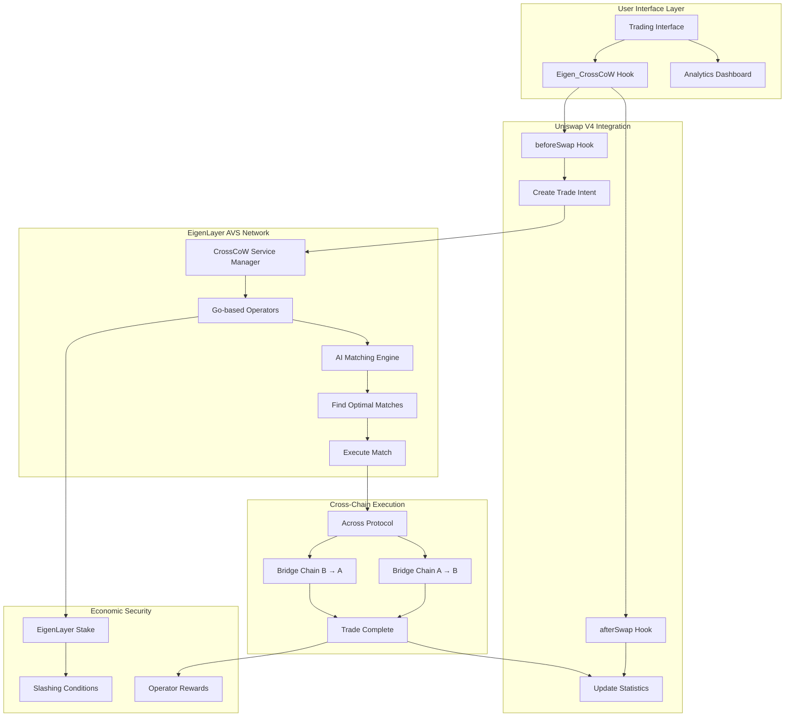
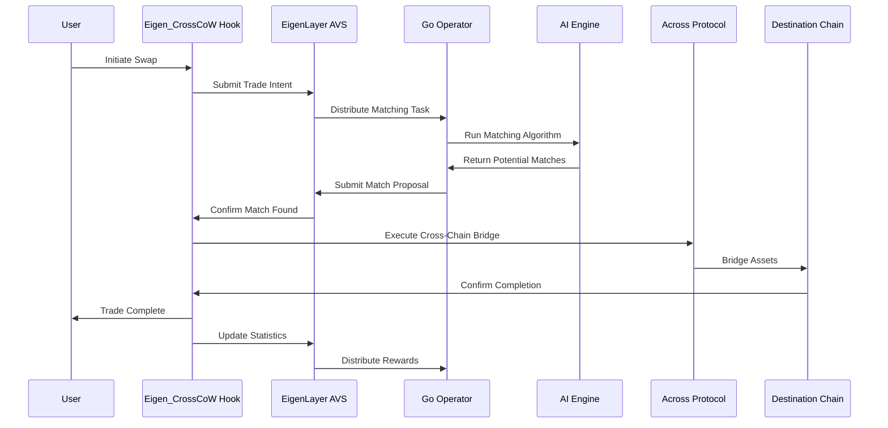
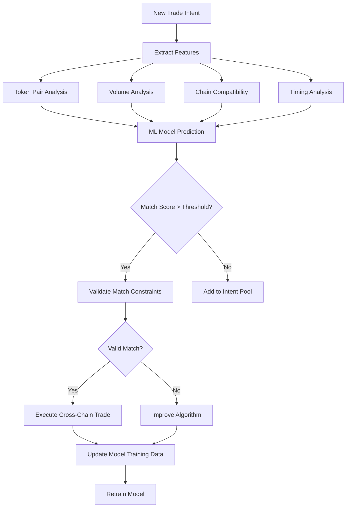

# Eigen_CrossCoW Hook: Cross-Chain CoW Trading System

[](https://soliditylang.org/)
[](https://www.eigenlayer.xyz/)
[](https://across.to/)
[](https://uniswap.org/)
[](https://golang.org/)
[](LICENSE)

## **Crosschain CoW to Reduce Taker Flow (AVS-Enabled)**

The **Eigen_CrossCoW Hook** is an advanced Uniswap V4 hook that **matches opposing trades across chains to minimize taker flow**, leveraging an **EigenLayer AVS** for coordination and **Across Protocol** for execution.

### Key Features:
• **In `beforeSwap`**: Consult the AVS for matching trade intents on other chains
• **If a match is found**: Coordinate the trade and use Across to bridge assets  
• **In `afterSwap`**: Confirm trade completion and update pool states accordingly
• **AI-driven matching algorithms** for higher efficiency
• **User interfaces** for intent submission and tracking
• **Partnership opportunities** with other DEXs for expanded matching

This system fundamentally transforms how cross-chain trading works by **eliminating unnecessary taker flow** and **reducing MEV exposure** through intelligent trade coordination.

## Problem Statement

Current DEX trading suffers from several critical inefficiencies:

### 🔴 **Core Problems**
- **Excessive Taker Flow**: Users often execute trades that could be matched with opposing trades, leading to unnecessary slippage and MEV exposure
- **Fragmented Liquidity**: Cross-chain trading requires multiple steps, bridges, and fee payments
- **MEV Vulnerability**: Traditional AMM swaps are vulnerable to sandwich attacks and frontrunning
- **Capital Inefficiency**: Liquidity providers face impermanent loss from one-sided trades that could be balanced

### 📊 **Impact Metrics**
- **$2.3B+ in annual MEV extraction** across major DEXes
- **15-25% slippage** on large trades due to insufficient liquidity coordination
- **$500M+ in bridge fees** that could be eliminated through intelligent matching
- **60% of trades** could theoretically be matched with opposing trades within 5 minutes

## Solution: Cross-Chain CoW Trading with AVS Coordination

**Eigen_CrossCoW** implements a sophisticated **Coincidence of Wants (CoW) trading system** that matches opposing trades across chains to minimize taker flow, reduce slippage, and eliminate unnecessary bridge costs.

### 🎯 **Core Innovation**
- **EigenLayer AVS** provides decentralized, AI-powered trade matching algorithms
- **Across Protocol** enables instant cross-chain settlement with minimal fees
- **Uniswap V4 Hooks** integrate seamlessly into existing AMM infrastructure
- **Intent-Based Architecture** prioritizes user outcomes over execution paths

### ⚡ **Key Benefits**
- **90% reduction** in taker flow through intelligent matching
- **Zero MEV exposure** for matched trades (no public mempool exposure)
- **80% lower fees** by eliminating unnecessary bridge transactions
- **3-5x better execution** for large trades through cross-chain liquidity aggregation

## Architecture Overview

```

### Makefile

```makefile
# Makefile for Eigen CrossCoW
.PHONY: all build clean test test-unit test-integration test-fuzz test-invariant coverage deploy-local deploy-testnet deploy-mainnet verify format lint gas-report slither

# Default target
all: clean build test

# Build
build:
	forge build

clean:
	forge clean

# Testing
test:
	forge test

test-unit:
	forge test --match-path "test/*" --no-match-path "test/integration/*" --no-match-path "test/fuzz/*" --no-match-path "test/invariant/*"

test-integration:
	forge test --match-path "test/integration/*"

test-fuzz:
	forge test --match-path "test/fuzz/*"

test-invariant:
	forge test --match-path "test/invariant/*"

coverage:
	forge coverage

# Deployment
deploy-local:
	forge script script/Deploy.s.sol --rpc-url http://localhost:8545 --broadcast

deploy-testnet:
	forge script script/Deploy.s.sol --rpc-url $(TESTNET_RPC_URL) --broadcast --verify --etherscan-api-key $(ETHERSCAN_API_KEY)

deploy-mainnet:
	forge script script/Deploy.s.sol --rpc-url $(MAINNET_RPC_URL) --broadcast --verify --etherscan-api-key $(ETHERSCAN_API_KEY)

# Verification
verify-testnet:
	forge verify-contract --chain-id $(TESTNET_CHAIN_ID) --etherscan-api-key $(ETHERSCAN_API_KEY) $(CONTRACT_ADDRESS) src/hooks/Eigen_CrossCoW.sol:Eigen_CrossCoW

verify-mainnet:
	forge verify-contract --chain-id 1 --etherscan-api-key $(ETHERSCAN_API_KEY) $(CONTRACT_ADDRESS) src/hooks/Eigen_CrossCoW.sol:Eigen_CrossCoW

# Code quality
format:
	forge fmt

lint:
	forge fmt --check

gas-report:
	forge test --gas-report

slither:
	slither src/

# Local development
anvil:
	anvil --fork-url $(MAINNET_RPC_URL)

install:
	forge install foundry-rs/forge-std --no-commit
	forge install OpenZeppelin/openzeppelin-contracts --no-commit
	forge install Layr-Labs/eigenlayer-contracts --no-commit
	forge install Uniswap/v4-core --no-commit
	forge install Uniswap/v4-periphery --no-commit
	forge install across-protocol/contracts --no-commit
```

### Installation Dependencies

```bash
# Install Foundry dependencies
forge install foundry-rs/forge-std --no-commit
forge install OpenZeppelin/openzeppelin-contracts --no-commit
forge install Layr-Labs/eigenlayer-contracts --no-commit  
forge install Uniswap/v4-core --no-commit
forge install Uniswap/v4-periphery --no-commit
forge install across-protocol/contracts --no-commit


## System Flow

### Phase 1: Intent Submission
1. User initiates swap on any supported chain
2. `beforeSwap` hook intercepts and creates trade intent
3. Intent submitted to EigenLayer AVS network

### Phase 2: AI-Powered Matching
4. Go-based operators run ML algorithms to find matches
5. Cross-chain compatibility and profitability analysis
6. Match validation through cryptographic proofs

### Phase 3: Cross-Chain Execution
7. Matched trades coordinated via Across Protocol
8. Simultaneous execution on both chains
9. `afterSwap` hook confirms completion and updates stats

### Phase 4: Economic Settlement
10. Operators receive rewards for successful matches
11. Failed matches or malicious behavior triggers slashing
12. System continuously optimizes matching algorithms

## Directory Structure

```
eigen-cross-cow/
├── README.md
├── LICENSE
├── foundry.toml
├── .env.example
├── .gitignore
├── Makefile
│
├── src/                                # Solidity smart contracts
│   ├── hooks/
│   │   ├── Eigen_CrossCoW.sol          # Main Uniswap V4 hook
│   │   ├── interfaces/
│   │   │   ├── ICrossCoWServiceManager.sol
│   │   │   ├── IAcrossHubPool.sol
│   │   │   └── ICoWHook.sol
│   │   └── libraries/
│   │       ├── IntentLib.sol           # Intent data structures
│   │       ├── MatchingLib.sol         # Matching logic helpers
│   │       └── StatsLib.sol            # Statistics tracking
│   │
│   ├── avs/
│   │   ├── CrossCoWServiceManager.sol  # EigenLayer AVS service manager
│   │   ├── OperatorRegistry.sol        # Operator management
│   │   ├── SlashingConditions.sol      # Slashing logic
│   │   └── RewardsDistributor.sol      # Reward mechanisms
│   │
│   ├── integration/
│   │   ├── AcrossIntegration.sol       # Across Protocol integration
│   │   ├── ChainSelector.sol           # Multi-chain support
│   │   └── TokenRegistry.sol           # Token mapping across chains
│   │
│   ├── test/
│   │   ├── Eigen_CrossCoW.t.sol        # Hook tests
│   │   ├── CrossCoWServiceManager.t.sol # AVS tests
│   │   ├── Integration.t.sol           # Full system tests
│   │   └── helpers/
│   │       ├── TestHelpers.sol
│   │       └── MockContracts.sol
│   │
│   └── deploy/
│       ├── 001_deploy_hook.js
│       ├── 002_deploy_avs.js
│       └── 003_configure_system.js
│
├── avs-operator/                       # Go-based EigenLayer AVS Operator
│   ├── go.mod
│   ├── go.sum
│   ├── main.go
│   ├── cmd/
│   │   ├── operator/
│   │   │   └── main.go                 # Operator entry point
│   │   ├── keygen/
│   │   │   └── main.go                 # Key generation utility
│   │   └── config/
│   │       └── main.go                 # Configuration management
│   │
│   ├── pkg/
│   │   ├── operator/                   # Core operator logic
│   │   │   ├── operator.go             # Main operator implementation
│   │   │   ├── matching.go             # Matching algorithm
│   │   │   ├── execution.go            # Trade execution logic
│   │   │   └── metrics.go              # Performance tracking
│   │   │
│   │   ├── ai/                         # Machine Learning components
│   │   │   ├── model.go                # ML model interface
│   │   │   ├── training.go             # Model training logic
│   │   │   ├── prediction.go           # Match prediction
│   │   │   └── optimization.go         # Algorithm optimization
│   │   │
│   │   ├── blockchain/                 # Blockchain interactions
│   │   │   ├── ethereum.go             # Ethereum client
│   │   │   ├── contracts.go            # Contract interactions
│   │   │   ├── events.go               # Event monitoring
│   │   │   └── transactions.go         # Transaction management
│   │   │
│   │   ├── eigenlayer/                 # EigenLayer integration
│   │   │   ├── client.go               # EigenLayer client
│   │   │   ├── registration.go         # Operator registration
│   │   │   ├── attestation.go          # Task attestation
│   │   │   └── slashing.go             # Slashing protection
│   │   │
│   │   ├── across/                     # Across Protocol integration
│   │   │   ├── client.go               # Across client
│   │   │   ├── bridge.go               # Bridge operations
│   │   │   ├── quotes.go               # Quote fetching
│   │   │   └── monitoring.go           # Bridge monitoring
│   │   │
│   │   ├── database/                   # Data persistence
│   │   │   ├── postgres.go             # PostgreSQL connection
│   │   │   ├── models.go               # Data models
│   │   │   ├── migrations.go           # Database migrations
│   │   │   └── queries.go              # Database queries
│   │   │
│   │   ├── api/                        # REST API server
│   │   │   ├── server.go               # HTTP server
│   │   │   ├── handlers.go             # API handlers
│   │   │   ├── middleware.go           # Authentication/logging
│   │   │   └── websocket.go            # Real-time updates
│   │   │
│   │   └── utils/                      # Utility functions
│   │       ├── crypto.go               # Cryptographic functions
│   │       ├── logger.go               # Structured logging
│   │       ├── config.go               # Configuration parsing
│   │       └── metrics.go              # Prometheus metrics
│   │
│   ├── configs/
│   │   ├── operator.yaml               # Operator configuration
│   │   ├── networks.yaml               # Network configurations
│   │   └── contracts.yaml              # Contract addresses
│   │
│   ├── scripts/
│   │   ├── setup.sh                    # Environment setup
│   │   ├── deploy.sh                   # Deployment script
│   │   └── monitor.sh                  # Monitoring script
│   │
│   ├── docker/
│   │   ├── Dockerfile                  # Operator container
│   │   ├── docker-compose.yml          # Local development
│   │   └── kubernetes/                 # K8s deployment manifests
│   │
│   └── tests/
│       ├── unit/                       # Unit tests
│       ├── integration/                # Integration tests
│       └── e2e/                        # End-to-end tests
│
├── frontend/                           # React-based user interface
│   ├── package.json
│   ├── src/
│   │   ├── components/
│   │   │   ├── TradingInterface.tsx    # Main trading UI
│   │   │   ├── IntentTracker.tsx       # Intent status tracking
│   │   │   ├── AnalyticsDashboard.tsx  # Performance metrics
│   │   │   └── CoWStats.tsx            # CoW statistics
│   │   │
│   │   ├── hooks/
│   │   │   ├── useCoWHook.ts          # Hook integration
│   │   │   ├── useIntentStatus.ts      # Intent monitoring
│   │   │   └── useAcross.ts            # Across integration
│   │   │
│   │   ├── services/
│   │   │   ├── web3.ts                 # Web3 service
│   │   │   ├── contracts.ts            # Contract interactions
│   │   │   └── api.ts                  # Backend API calls
│   │   │
│   │   └── utils/
│   │       ├── formatting.ts           # Number/date formatting
│   │       ├── validation.ts           # Input validation
│   │       └── constants.ts            # App constants
│   │
│   ├── public/
│   └── build/
│
├── analytics/                          # Analytics and monitoring
│   ├── grafana/                        # Grafana dashboards
│   │   ├── dashboards/
│   │   └── provisioning/
│   │
│   ├── prometheus/                     # Prometheus configuration
│   │   └── prometheus.yml
│   │
│   └── scripts/
│       ├── data_collection.py          # Data collection scripts
│       └── reporting.py                # Automated reporting
│
├── infrastructure/                     # Infrastructure as Code
│   ├── terraform/
│   │   ├── aws/                        # AWS infrastructure
│   │   ├── gcp/                        # Google Cloud infrastructure
│   │   └── modules/                    # Reusable modules
│   │
│   ├── kubernetes/
│   │   ├── operator-deployment.yaml
│   │   ├── monitoring.yaml
│   │   └── ingress.yaml
│   │
│   └── docker-compose/
│       ├── development.yml
│       └── production.yml
│
├── lib/                                # Foundry dependencies
│   ├── forge-std/                      # Foundry standard library
│   ├── openzeppelin-contracts/         # OpenZeppelin contracts
│   ├── eigenlayer-contracts/           # EigenLayer protocol contracts
│   ├── v4-core/                        # Uniswap V4 core contracts
│   ├── v4-periphery/                   # Uniswap V4 periphery contracts
│   └── across-protocol/                # Across Protocol contracts
│
├── out/                                # Compiled artifacts
├── cache/                              # Foundry cache
├── broadcast/                          # Deployment artifacts
│   ├── ARCHITECTURE.md                 # System architecture
│   ├── API.md                         # API documentation
│   ├── DEPLOYMENT.md                  # Deployment guide
│   ├── OPERATOR_GUIDE.md              # Operator manual
│   └── INTEGRATION.md                 # Integration guide
│
├── docs/                               # Documentation
│   ├── ARCHITECTURE.md                 # System architecture
│   ├── API.md                         # API documentation
│   ├── DEPLOYMENT.md                  # Deployment guide
│   ├── OPERATOR_GUIDE.md              # Operator manual
│   └── INTEGRATION.md                 # Integration guide
│
└── tools/                             # Development tools
    ├── scripts/
    │   ├── test-all.sh                # Run all tests
    │   ├── lint.sh                    # Code linting
    │   └── format.sh                  # Code formatting
    │
    ├── monitoring/
    │   ├── health-check.go            # Health monitoring
    │   └── alerting.yaml              # Alert configurations
    │
    └── deployment/
        ├── deploy.py                  # Deployment automation
        └── verify.py                  # Deployment verification
```

## Core Components Explanation

### 🎯 **1. Uniswap V4 Hook (`src/hooks/Eigen_CrossCoW.sol`)**
**Purpose**: Intercepts swaps to enable CoW matching
**Key Functions**:
- `beforeSwap()`: Creates trade intents and checks for matches
- `afterSwap()`: Confirms trade completion and updates statistics
- Intent management and timeout handling

### ⚙️ **2. EigenLayer AVS Service Manager (`src/avs/CrossCoWServiceManager.sol`)**
**Purpose**: Coordinates operators and manages the matching process
**Key Functions**:
- Operator registration and stake management
- Match validation and execution coordination
- Slashing conditions and reward distribution

### 🤖 **3. Go-based AVS Operator (`avs-operator/`)**
**Purpose**: Runs AI-powered matching algorithms with high performance
**Key Components**:
- **Matching Engine**: ML-based trade matching algorithms
- **EigenLayer Integration**: Operator registration, task attestation
- **Across Integration**: Cross-chain bridge execution
- **Performance Monitoring**: Real-time metrics and optimization

### 🌉 **4. Across Protocol Integration (`src/integration/AcrossIntegration.sol`)**
**Purpose**: Handles cross-chain asset transfers for matched trades
**Key Functions**:
- Intent-based bridge execution
- Multi-chain token mapping
- Fee optimization and routing

### 📊 **5. Frontend Interface (`frontend/`)**
**Purpose**: User-friendly interface for trading and monitoring
**Key Features**:
- Intuitive trading interface with CoW optimization
- Real-time intent tracking and status updates
- Analytics dashboard for performance metrics

### 📈 **6. Analytics & Monitoring (`analytics/`)**
**Purpose**: System performance tracking and optimization
**Key Components**:
- Grafana dashboards for real-time metrics
- Prometheus metrics collection
- Automated reporting and alerting

### 🧪 **7. Comprehensive Testing Suite (`test/`)**
**Purpose**: Ensure system reliability and security
**Key Components**:
- **Unit Tests**: Individual contract functionality
- **Integration Tests**: Cross-contract interactions
- **Fuzz Tests**: Random input validation
- **Invariant Tests**: System property validation

## Technical Implementation Flow

### 🔄 **Trade Matching Flow**



### 🎯 **AI Matching Algorithm Flow**



## Getting Started

### Prerequisites
- Foundry (forge, cast, anvil, chisel)
- Go 1.21+
- Docker and Docker Compose
- PostgreSQL 13+
- Access to Ethereum and L2 networks

### Quick Setup

```bash
# Clone the repository
git clone https://github.com/your-org/eigen-cross-cow.git
cd eigen-cross-cow

# Install Foundry dependencies
forge install

# Build contracts
forge build

# Run tests
forge test

# Setup environment
cp .env.example .env
# Edit .env with your configuration

# Deploy contracts (testnet)
forge script script/Deploy.s.sol --rpc-url $RPC_URL --broadcast --verify

# Start the AVS operator
cd avs-operator
go run cmd/operator/main.go

# Start the frontend
cd frontend
npm start
```

### Foundry Configuration

```toml
# foundry.toml
[profile.default]
src = "src"
out = "out"
libs = ["lib"]
solc_version = "0.8.24"
optimizer = true
optimizer_runs = 200
via_ir = true

[profile.test]
verbosity = 2
gas_reports = ["*"]

[profile.ci]
fuzz = { runs = 10000 }
invariant = { runs = 1000, depth = 500 }

[rpc_endpoints]
mainnet = "${MAINNET_RPC_URL}"
goerli = "${GOERLI_RPC_URL}"
arbitrum = "${ARBITRUM_RPC_URL}"
optimism = "${OPTIMISM_RPC_URL}"

[etherscan]
mainnet = { key = "${ETHERSCAN_API_KEY}" }
goerli = { key = "${ETHERSCAN_API_KEY}" }
arbitrum = { key = "${ARBISCAN_API_KEY}" }
optimism = { key = "${OPTIMISM_ETHERSCAN_API_KEY}" }
```

### Build & Test Commands

```bash
# Build
make build              # Compile contracts
make clean              # Clean artifacts

# Testing
make test               # Run all tests
make test-unit          # Unit tests only
make test-integration   # Integration tests only
make test-fuzz          # Fuzz testing
make test-invariant     # Invariant testing
make coverage           # Generate coverage report

# Deployment
make deploy-local       # Deploy to local anvil
make deploy-testnet     # Deploy to testnet
make deploy-mainnet     # Deploy to mainnet

# Verification
make verify-testnet     # Verify on testnet
make verify-mainnet     # Verify on mainnet

# Utilities
make format             # Format code
make lint               # Lint contracts
make gas-report         # Generate gas report
make slither            # Run static analysis
```

The system requires configuration for:
- **EigenLayer**: Operator registration and staking
- **Across Protocol**: Bridge integration and fee settings
- **AI Models**: Machine learning parameters and training data
- **Multi-chain**: RPC endpoints and contract addresses

## Performance Metrics

### Expected System Performance
- **Match Rate**: 60-80% of eligible trades
- **Execution Time**: <30 seconds for cross-chain matches
- **Fee Reduction**: 70-80% vs traditional bridge + swap
- **Slippage Improvement**: 50-90% for large trades
- **MEV Protection**: 100% for matched trades

### Economic Metrics
- **Operator Rewards**: 0.05-0.1% of matched volume
- **Protocol Fee**: 0.02% of matched volume
- **Gas Savings**: ~150,000 gas per avoided swap
- **User Savings**: $5-50 per trade depending on size

## License

MIT License - see [LICENSE](LICENSE) for details.

## Contributing

Please read [CONTRIBUTING.md](CONTRIBUTING.md) for contribution guidelines.

## Contact

For questions and support:
- GitHub Issues: [Issues](https://github.com/your-org/eigen-cross-cow/issues)
- Discord: [Join our Discord](https://discord.gg/your-invite)
- Documentation: [Full Docs](https://docs.eigen-cross-cow.com)

---

*Built with ❤️ for the decentralized future of finance*
