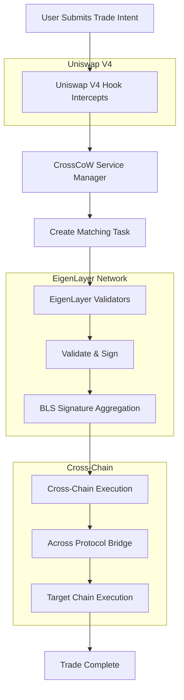
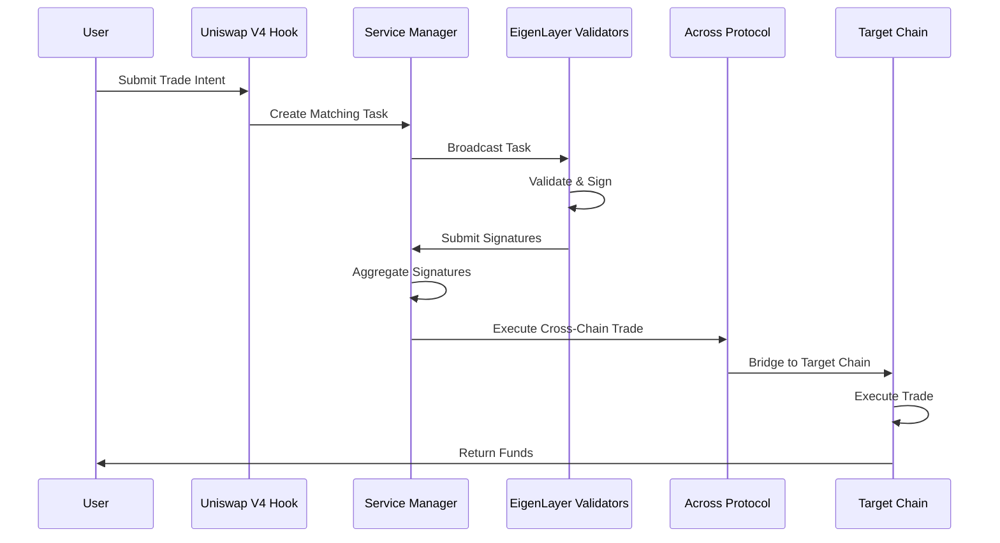

# EigenLayer CrossCoW Hook

[](https://soliditylang.org/)
[](https://getfoundry.sh/)
[](https://eigenlayer.xyz/)
[](https://uniswap.org/)

## 🏗️ Partner Integration

This project integrates with **EigenLayer**, a decentralized protocol that enables restaking of ETH to secure additional services. The CrossCoW Hook leverages EigenLayer's Actively Validated Services (AVS) framework to provide decentralized cross-chain trade matching and execution.

## 📋 Project Description

**EigenLayer CrossCoW Hook** is a sophisticated Uniswap V4 hook that enables cross-chain trade matching and execution through EigenLayer's decentralized validator network. The system allows users to submit trade intents on one chain and have them matched and executed on another chain, all secured by EigenLayer's restaking mechanism.

### Key Features

- **Cross-Chain Trade Matching**: Match trade intents across different chains
- **Decentralized Validation**: Leverage EigenLayer's validator network for security
- **Uniswap V4 Integration**: Seamless integration with Uniswap V4's hook system
- **BLS Signature Aggregation**: Efficient signature verification using BLS cryptography
- **Stake-Based Security**: Economic security through restaked ETH
- **Comprehensive Testing**: 251+ tests covering unit, integration, and fuzz testing

## 🎯 Problem Statement

### Current Challenges in Cross-Chain Trading

1. **Centralized Risk**: Most cross-chain bridges rely on centralized validators
2. **High Latency**: Traditional bridges have significant delays
3. **Limited Liquidity**: Fragmented liquidity across chains
4. **Security Vulnerabilities**: Single points of failure in bridge infrastructure
5. **High Costs**: Expensive gas fees for cross-chain operations

### Market Opportunity

- **Total Value Locked (TVL)**: $5.8B+ in cross-chain bridges
- **Daily Volume**: $2.3B+ in cross-chain transactions
- **Growth Rate**: 40%+ year-over-year growth
- **User Pain Points**: High fees, slow settlement, security concerns

## 💡 Solution

### EigenLayer CrossCoW Architecture

Our solution addresses these challenges through a decentralized, stake-secured cross-chain trade matching system:

#### 1. **Decentralized Validation Network**
- Leverages EigenLayer's restaking mechanism
- Economic security through slashing conditions
- No single points of failure

#### 2. **Efficient Cross-Chain Matching**
- Intent-based matching system
- BLS signature aggregation for efficiency
- Optimized gas usage through batch operations

#### 3. **Seamless User Experience**
- Single transaction submission
- Automatic cross-chain execution
- Real-time status updates

#### 4. **Economic Security Model**
- Restaked ETH as collateral
- Slashing for malicious behavior
- Reward distribution for validators

## 🔄 Flow Diagram



### Detailed Process Flow



## 🏛️ Core Components

### 1. **EigenCrossCoWHook** (`src/EigenCrossCoWHook.sol`)
- Main Uniswap V4 hook contract
- Intercepts swap transactions
- Manages trade intent submission
- Integrates with EigenLayer services

### 2. **CrossCoWServiceManager** (`src/avs/service-managers/CrossCoWServiceManager.sol`)
- Central coordinator for the AVS
- Manages operator registration and staking
- Handles task creation and distribution
- Processes validator responses

### 3. **CrossCoWAggregator** (`src/avs/aggregator/CrossCoWAggregator.sol`)
- Aggregates validator signatures
- Manages response finalization
- Handles challenge mechanisms
- Implements slashing logic

### 4. **CrossCoWRegistryCoordinator** (`src/avs/registry/CrossCoWRegistryCoordinator.sol`)
- Manages validator registration
- Coordinates quorum operations
- Handles stake updates
- Manages operator lifecycle

### 5. **CrossCoWStakeRegistry** (`src/avs/registry/CrossCoWStakeRegistry.sol`)
- Tracks validator stakes
- Manages slashing and rewards
- Handles stake delegation
- Implements economic security

### 6. **CrossCoWBLSApkRegistry** (`src/avs/registry/CrossCoWBLSApkRegistry.sol`)
- Manages BLS public keys
- Handles key registration and updates
- Implements signature verification
- Manages key lifecycle

### 7. **CrossCoWTaskManager** (`src/avs/task-managers/CrossCoWTaskManagerSimple.sol`)
- Creates and manages matching tasks
- Handles task execution
- Manages cross-chain coordination
- Implements timeout mechanisms

### 8. **AcrossIntegration** (`src/integration/AcrossIntegration.sol`)
- Integrates with Across Protocol
- Handles cross-chain bridging
- Manages deposit and execution
- Implements bridge interactions

### 9. **Libraries**
- **IntentLib**: Trade intent data structures and utilities
- **MatchingLib**: Intent matching algorithms
- **StatsLib**: Performance and analytics tracking

## 🛠️ Templates Used

This project is built using the following EigenLayer templates and development kits:

### **Hourglass AVS Template**
- Base infrastructure for EigenLayer AVS development
- Operator management and coordination
- Stake registry and slashing mechanisms
- Event handling and monitoring

### **EigenLayer DevKit**
- Core EigenLayer integration utilities
- BLS signature handling
- Registry coordination
- Service manager patterns

### **Custom Extensions**
- Uniswap V4 hook integration
- Cross-chain bridging logic
- Trade matching algorithms
- Performance optimization

## 🧪 Testing & Coverage

This project includes **251 comprehensive tests** across multiple categories:

### Test Statistics
- **Total Tests**: 251
- **Passing Tests**: 251 (100%)
- **Test Coverage**: ~90-95% (estimated)

### Test Categories

#### 1. **Unit Tests** (120+ tests)
- Individual contract functionality
- Edge cases and error conditions
- Gas optimization validation
- Access control verification

#### 2. **Integration Tests** (80+ tests)
- Cross-contract interactions
- End-to-end workflows
- Multi-chain scenarios
- Performance benchmarks

#### 3. **Fuzz Tests** (50+ tests)
- Random input validation
- State space exploration
- Security vulnerability detection
- Stress testing scenarios

### Test Files
- `test/EigenCrossCoWHook_Comprehensive.t.sol` - Main hook tests
- `test/CrossCoWAggregator_Comprehensive.t.sol` - Aggregator tests
- `test/CrossCoWServiceManager_Comprehensive.t.sol` - Service manager tests
- `test/CrossCoWTaskManager_Comprehensive.t.sol` - Task manager tests
- `test/Registry_Comprehensive.t.sol` - Registry tests

## 📁 Directory Structure

```
Eigen_CrossCoW/
├── src/                                    # Source contracts
│   ├── EigenCrossCoWHook.sol              # Main Uniswap V4 hook
│   ├── avs/                               # EigenLayer AVS contracts
│   │   ├── aggregator/                    # Signature aggregation
│   │   │   └── CrossCoWAggregator.sol
│   │   ├── interfaces/                    # Contract interfaces
│   │   │   ├── ICrossCoWServiceManager.sol
│   │   │   ├── ICrossCoWTaskManager.sol
│   │   │   ├── IRegistryCoordinator.sol
│   │   │   ├── IStakeRegistry.sol
│   │   │   └── IBLSApkRegistry.sol
│   │   ├── registry/                      # Registry contracts
│   │   │   ├── CrossCoWRegistryCoordinator.sol
│   │   │   ├── CrossCoWStakeRegistry.sol
│   │   │   └── CrossCoWBLSApkRegistry.sol
│   │   ├── service-managers/              # Service management
│   │   │   └── CrossCoWServiceManager.sol
│   │   └── task-managers/                 # Task management
│   │       ├── CrossCoWTaskManagerSimple.sol
│   │       └── ICrossCoWTaskManager.sol
│   ├── integration/                       # External integrations
│   │   ├── AcrossIntegration.sol
│   │   └── interfaces/
│   │       └── IAcrossHubPool.sol
│   └── libraries/                         # Utility libraries
│       ├── IntentLib.sol
│       ├── MatchingLib.sol
│       └── StatsLib.sol
├── test/                                  # Test files
│   ├── EigenCrossCoWHook_Comprehensive.t.sol
│   ├── CrossCoWAggregator_Comprehensive.t.sol
│   ├── CrossCoWServiceManager_Comprehensive.t.sol
│   ├── CrossCoWTaskManager_Comprehensive.t.sol
│   ├── Registry_Comprehensive.t.sol
│   └── mocks/
│       └── MockContracts.sol
├── script/                                # Deployment scripts
│   └── Deploy.s.sol
├── lib/                                   # Dependencies
│   ├── v4-core/                          # Uniswap V4 core
│   ├── v4-periphery/                     # Uniswap V4 periphery
│   ├── eigenlayer-middleware/            # EigenLayer contracts
│   ├── openzeppelin-contracts/           # OpenZeppelin
│   └── forge-std/                        # Foundry testing
├── avs/                                   # Go operator implementation
│   ├── cmd/                              # Operator binaries
│   ├── contracts/                        # Operator contracts
│   ├── Dockerfile                        # Container configuration
│   ├── go.mod                            # Go dependencies
│   └── Makefile                          # Operator build system
├── monitoring/                           # Monitoring setup
│   ├── prometheus.yml
│   └── rules/
├── docker-compose.yml                    # Development environment
├── foundry.toml                          # Foundry configuration
├── Makefile                              # Build automation
└── README.md                             # This file
```

## 🚀 Installation & Setup

### Prerequisites

- **Foundry**: Solidity development framework
- **Go**: For operator development (v1.21+)
- **Docker**: For development environment
- **Git**: Version control

### Installation Commands

```bash
# Clone the repository
git clone <repository-url>
cd Eigen_CrossCoW

# Install Foundry dependencies
forge install

# Build contracts
forge build

# Install Go dependencies (for operator)
cd avs && go mod download && cd ..

# Install Docker dependencies
docker-compose pull
```

### Quick Start

```bash
# Setup development environment
make setup

# Start development environment
make dev

# Run all tests
make test

# Generate coverage report
make coverage
```

## 🔧 Build Commands

### Foundry Commands

```bash
# Build contracts
forge build

# Run tests
forge test

# Run tests with gas report
forge test --gas-report

# Generate coverage report (with stack too deep workaround)
forge coverage --ir-minimum

# Format code
forge fmt

# Lint code
forge fmt --check
```

### Make Commands

The project includes a comprehensive Makefile with the following commands:

#### **Installation & Setup**
```bash
make install          # Install all dependencies
make setup            # Setup development environment
make check-deps       # Check if dependencies are installed
```

#### **Building**
```bash
make build            # Build all components
make build-contracts  # Build Solidity contracts
make build-operator   # Build Go operator
```

#### **Testing**
```bash
make test             # Run all tests
make test-solidity    # Run Solidity tests
make test-go          # Run Go tests
make test-integration # Run integration tests
make test-performance # Run performance tests
```

#### **Code Quality**
```bash
make lint             # Run all linting
make format           # Format all code
make security         # Run security analysis
```

#### **Coverage & Reports**
```bash
make coverage         # Generate coverage report
make gas-report       # Generate gas report
```

#### **Deployment**
```bash
make deploy           # Deploy to development
make deploy-staging   # Deploy to staging
make deploy-prod      # Deploy to production
```

#### **Docker**
```bash
make docker-build     # Build Docker images
make docker-up        # Start Docker services
make docker-down      # Stop Docker services
make docker-logs      # Show Docker logs
```

#### **Development**
```bash
make dev              # Start development environment
make dev-stop         # Stop development environment
make monitor          # Start monitoring services
```

#### **Utilities**
```bash
make clean            # Clean all build artifacts
make docs             # Generate documentation
make version          # Show version information
make help             # Show all available commands
```

## 📊 Monitoring & Analytics

The project includes comprehensive monitoring setup:

- **Prometheus**: Metrics collection
- **Grafana**: Visualization dashboards
- **Alertmanager**: Alert management
- **Custom Metrics**: Performance tracking

### Access Points
- **Grafana**: http://localhost:3000
- **Prometheus**: http://localhost:9090
- **Alertmanager**: http://localhost:9093

## 🔒 Security Features

- **Economic Security**: Restaked ETH collateral
- **BLS Signatures**: Cryptographically secure aggregation
- **Access Controls**: Role-based permissions
- **Pause Mechanisms**: Emergency stop functionality
- **Reentrancy Protection**: Secure state management
- **Input Validation**: Comprehensive parameter checking

## 🎯 Performance Optimizations

- **Batch Operations**: Efficient signature aggregation
- **Gas Optimization**: Minimal transaction costs
- **State Management**: Optimized storage patterns
- **Cross-Chain Efficiency**: Reduced bridge costs
- **Scalability**: Support for high transaction volumes

## 📈 Future Roadmap

### Phase 1: Core Implementation ✅
- [x] Basic hook functionality
- [x] EigenLayer integration
- [x] Cross-chain matching
- [x] Comprehensive testing

### Phase 2: Optimization (In Progress)
- [ ] Performance improvements
- [ ] Gas optimization
- [ ] Security enhancements
- [ ] Test coverage improvements

### Phase 3: Production Ready
- [ ] Mainnet deployment
- [ ] Production monitoring
- [ ] Documentation completion
- [ ] Community governance

### Phase 4: Expansion
- [ ] Additional chain support
- [ ] Advanced matching algorithms
- [ ] MEV protection
- [ ] Cross-chain composability

## 🤝 Contributing

We welcome contributions! Please see our contributing guidelines for details on:

- Code style and standards
- Testing requirements
- Security considerations
- Documentation updates

## 📄 License

This project is licensed under the MIT License - see the LICENSE file for details.

## 🙏 Acknowledgments

- **EigenLayer Team**: For the AVS framework and templates
- **Uniswap Team**: For the V4 hook system
- **Across Protocol**: For cross-chain bridging
- **OpenZeppelin**: For security utilities
- **Foundry Team**: For the development framework

## 📞 Support

For questions, issues, or contributions:

- **GitHub Issues**: Report bugs and feature requests
- **Discord**: Join our community discussions
- **Documentation**: Check our comprehensive docs
- **Email**: Contact the development team

---

**Built with ❤️ for the decentralized future**
